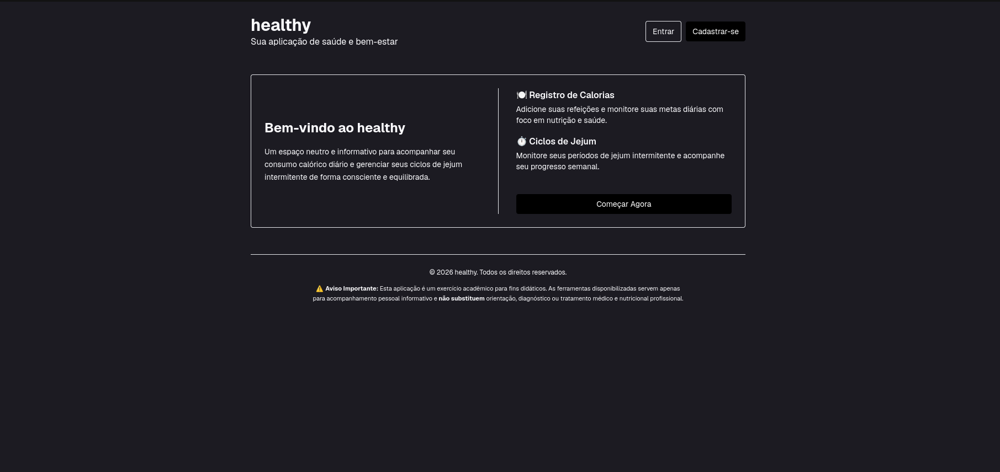
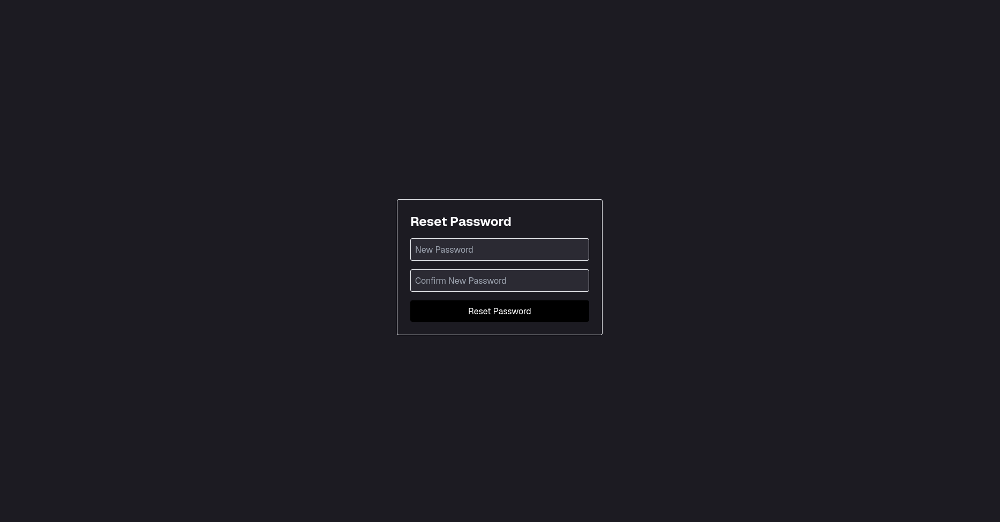
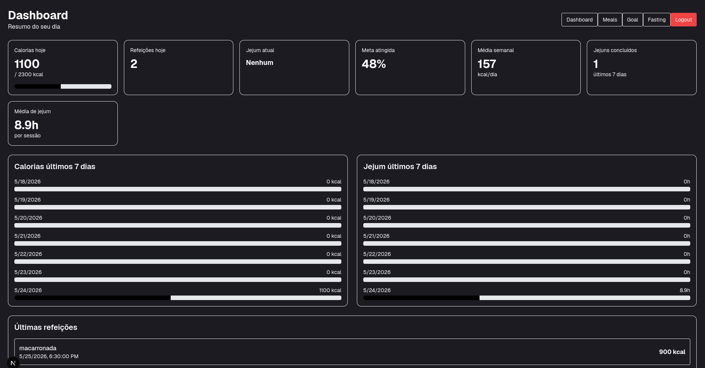

* healthy

#+text: Uma aplicação web full-stack voltada para o acompanhamento consciente de consumo calórico e ciclos de jejum intermitente.

** [[https://healthy.niihash.com][Acesse a aplicação em produção]]
** [[https://drive.google.com/file/d/19vZNd5GOC0_e6Sp5iPuSTwwxO8CpBfgR/view?usp=sharing][Assista ao vídeo demonstrativo]]

---

** Descrição do Projeto

O *healthy* é um sistema que visa promover o bem-estar através do registro de dados de saúde de forma neutra e estritamente informativa. A aplicação permite que os usuários monitorem suas refeições diárias, estabeleçam metas calóricas personalizadas e acompanhem seus períodos de jejum sem apelos estéticos ou incentivo a dietas restritivas.

---

** Stack Técnica

- *Framework:* Next.js (App Router)
- *Linguagem:* TypeScript
- *Estilização:* Tailwind CSS
- *Banco de Dados & Autenticação:* Supabase (Supabase Auth)
- *Hospedagem:* CloudFlare / Domínio Próprio

---

** Funcionalidades Principais

- [X] *Autenticação Segura:* Cadastro, Login e Fluxo de Recuperação de Senha integrado ao Supabase.
- [X] *Registro de Refeições:* Interface minimalista para lançamento e controle do consumo calórico diário.
- [X] *Ciclos de Jejum:* Cronômetro e histórico de períodos de jejum intermitente.
- [X] *Progresso Semanal:* Visualização limpa e simplificada das metas atingidas ao longo da semana.

---

** Variáveis de Ambiente necessárias

Crie um arquivo =.env.local= na raiz do projeto e adicione as seguintes chaves do seu projeto Supabase:

#+begin_src env
NEXT_PUBLIC_SUPABASE_URL=sua_url_do_supabase_aqui
NEXT_PUBLIC_SUPABASE_ANON_KEY=sua_chave_anon_do_supabase_aqui
#+end_src

---

** Instruções de Setup Local

Siga os passos abaixo para rodar o projeto na sua máquina:

1. Clone o repositório:
   #+begin_src bash
   git clone https://github.com/niihash/healthy.git
   cd healthy
   #+end_src

2. Instale as dependências:
   #+begin_src bash
   npm install
   #+end_src

3. Configure o arquivo =.env.local= conforme o modelo acima.

4. Inicie o servidor de desenvolvimento:
   #+begin_src bash
   npm run dev
   #+end_src

5. Abra [[http://localhost:3000]] no seu navegador.

---

** Screenshots das Principais Telas

#+caption: Tela Inicial do healthy

#+caption: Tela de Recuperação de Senha

#+caption: Dashboard do Usuário (Em desenvolvimento)

